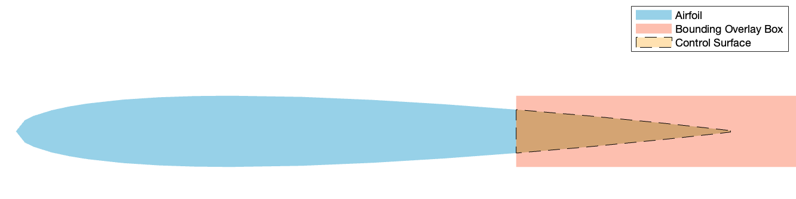
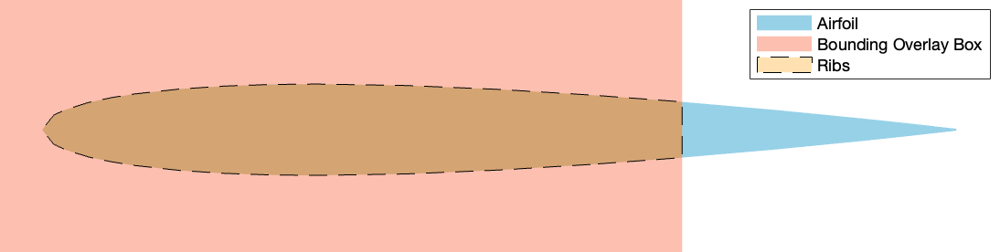
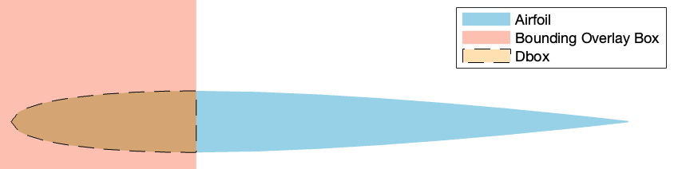

# `calcMass_BuiltupWing.m`
> Yuya Sugo, Performance Lead 2024-2025, USC AeroDesign Team </br> 5/17/2024

<!--ts-->
* [calcMass_BuiltupWing.m](#calcmass_builtupwingm)
   * [Main Purpose](#main-purpose)
   * [Background Knowledge](#background-knowledge)
   * [Code Breakdown](#code-breakdown)

<!-- Created by https://github.com/ekalinin/github-markdown-toc -->
<!-- Added by: yuyasugo, at: Wed May 29 00:49:46 JST 2024 -->

<!--te-->

## Main Purpose

This function estimates the mass of a buildup wing based on input parameter `plane` struct and outputs `massBuiltupWing` struct and an updated `plane` struct

## Background Knowledge

## Code Breakdown
```MATLAB
% setting params from plane
chord = plane.c;
span = plane.b;
fuselage_width = plane.wFuse;
control_frac = plane.wingControlFraction;
```
Defines local variable for easier access.
```MATLAB
% reading in airfoil x, y coordinates
airfoilFileName = plane.airfoilCoordinatesFile; % need to have this as input!
    % read file (specifically the appropriate lines only)
    airfoilDataOpts = detectImportOptions(airfoilFileName);
    airfoilDataOpts.DataLines = [10, inf]; % NOTE: ASSUMES THAT THE AIRFOIL DATA STARTS ON LINE 10
    airfoilData = readmatrix(airfoilFileName, airfoilDataOpts);
    % convert from c = 100 -> c = 1
    airfoilData = airfoilData ./ 100;
    % adjust to chord length
    airfoilData = airfoilData .* chord;
    % separate into x and y
    x = airfoilData(:,1);
    y = airfoilData(:,2);
```
This gets the `x` and `y` coords of the airfoil shape. `detectImportOptions` looks at the file it is pointed to and returns an OPTS object based on the type of input file (delimitated text, spreadsheet, word doc., html, etc). Based on this, it looks at the `.DataLines` and edits it to be from the row the airfoil data starts. Then, using `readmatrix` it reads the airfoil file with the data options OPTS file as an input as well. From this, it normalizes the values so that its chord is 1, then multiplies by the dimensional chord value to get the chord. Then it splits this 2D array into two 1D array of `x` and `y` coords of the airfoil shape.

```MATLAB
% rib assumptions
rib_cutout = 0.8; % percent of wood left after mass-reduction cuts made
thickness_ribs = 0.003175; %m = 1/8 inch
num_ribs = 10 * 2; % per side -> total
rib_spacing = (span - plane.wFuse - 2*thickness_ribs)/(2*num_ribs - 2); %m, space between ribs on one side
% num_ply_ribs = ceil(0.6*num_ribs);
num_ply_ribs = 3 * 2; % per side -> total, 1 each for flaps, ailerons, base
% num_balsa_ribs = floor(0.4*num_ribs);
num_balsa_ribs = num_ribs - num_ply_ribs;
epoxy_glue = 0.01; %kg, weight of epoxy used per rib
```

Creates assumptions about the how each rib will look like and what materials the ribs will use. rib_spacing is not used in this current code. 

```MATLAB
% spar assumptions
thickness_mainSpar = 0.003175; %m = 1/8 in
thickness_aftSpar = 0.003175; %m = 1/8 inch
```

Defines the thicknesses of the spars.

```MATLAB
% epoxy
epoxy_ratio = 0.55;

% density of materials
density_balsa = 160; %kg/m3
density_ply = 680; %kg/m3
density_foam = 3 * 16.018; % converting 3 lb/ft^3 foam to kg/m^3
density_carbonFiber = 5.5 / 29.494; %oz/yd2 --> kg/m2
density_uniCarbonFiber = 4.7 / 29.494; %oz/yd2 --> kg/m2 from https://www.cstsales.com/uni_carbon_fabric-ss2.html
density_solite = 0.7 / 29.494; %oz/yd2 --> kg/m2
```

Defines the densities used for volume/area to mass conversion. 

```MATLAB
%% FULL AIRFOIL
airfoilPoly=polyshape(x,y);
plane.airfoilPerimeter = perimeter(airfoilPoly);
```

Creates a polyshape object with the coords of the airfoil. This is useful since it can be used to calculate perimeter (seen here), area, intersection, etc. 

```MATLAB
%% CONTROL SURFACE (AFT 30%)
polyBox_controlSurface = polyshape([(1-control_frac)*chord chord+5 chord+5 (1-control_frac)*chord],[max(y) max(y) min(y) min(y)]);
controlSurface = intersect(airfoilPoly,polyBox_controlSurface);
area_ControlSurface = area(controlSurface);
volume_ControlSurface = area_ControlSurface*(span-fuselage_width);

if strcmpi(plane.controlSurfMat, "balsa")
    m_ControlSurface = volume_ControlSurface * density_balsa;
elseif strcmpi(plane.controlSurfMat, "foam")
    m_ControlSurface = volume_ControlSurface * density_foam;
end
```

This code segments determines the mass of the control surface. It first creates an oversized bounding overlay box using the control fraction as `polyBox_controlSurface` and then finds the intersecting area between this box and the airfoil. This can be seen in the figure below:



From this, it calculates the area of the control surface, then the volume (using `span - fuse_width`) then the mass using the density. 

```MATLAB
%% RIBS (FRONT 70%)
polyBox_ribs = polyshape([-1 (1-control_frac)*chord (1-control_frac)*chord -1],[max(y)+5 max(y)+5 min(y)-5 min(y)-5]);
ribs = intersect(airfoilPoly,polyBox_ribs);
area_Ribs = area(ribs);
perim_Ribs = perimeter(ribs);

volume_Ply_Ribs = area_Ribs * thickness_ribs * num_ply_ribs ;
m_Ply_Ribs = density_ply * volume_Ply_Ribs;

volume_Balsa_Ribs = area_Ribs * thickness_ribs * num_balsa_ribs ;
m_Balsa_Ribs = density_balsa * volume_Balsa_Ribs;

m_Ribs = (m_Ply_Ribs + m_Balsa_Ribs) * rib_cutout;
m_epoxy_ribs = epoxy_glue * num_ribs;
```

Similarly to the control surface, it gets the area, and then the total volume of the ribs using thickness (defined above) and the rib count for both balsa and plywood. Then, multiplying the volume by the density, it gets the mass and then the mass reducing cutouts are applied. The epoxy required for each rib is also calculated. 




```
%% MAIN SPAR
polyBox_mainSpar = polyshape([.25*chord-thickness_mainSpar/2 .25*chord+thickness_mainSpar/2 .25*chord+thickness_mainSpar/2 .25*chord-thickness_mainSpar/2],[max(y)+5 max(y)+5 min(y)-5 min(y)-5]);
mainSpar = intersect(airfoilPoly,polyBox_mainSpar);
area_mainSpar = area(mainSpar);

volume_mainSpar = area_mainSpar * span;
m_mainSpar = volume_mainSpar * density_ply;

%% AFT SPAR
polyBox_aftSpar = polyshape([(1-control_frac)*chord-thickness_aftSpar (1-control_frac)*chord (1-control_frac)*chord (1-control_frac)*chord-thickness_aftSpar],[max(y)+5 max(y)+5 min(y)-5 min(y)-5]);
aftSpar = intersect(airfoilPoly,polyBox_aftSpar);
area_aftSpar = area(aftSpar);

volume_aftSpar = area_aftSpar * span;
m_aftSpar = volume_aftSpar * density_ply;
```
The same method is used for both the main and aft spar. These assume a plywood shear-web spar without sparcaps. 

```MATLAB
%% LE SKIN TO dboxFraction (as percent)
dboxFraction = 0.30;
LEskin_inboard_width = 2.5 * fuselage_width;
polyBox_LEskin = polyshape([-1 dboxFraction*chord dboxFraction*chord -1],[max(y)+5 max(y)+5 min(y)-5 min(y)-5]);
LEskin = intersect(airfoilPoly,polyBox_LEskin);
perim_LEskin = perimeter(LEskin);
perim_LEskin_inboard = perim_Ribs;

area_LEskin = perim_LEskin * (span-LEskin_inboard_width);
area_LEskin_inboard = perim_LEskin_inboard * LEskin_inboard_width;
m_LEskin = (area_LEskin + area_LEskin_inboard) * density_carbonFiber;

m_epoxy_LEskin = (epoxy_ratio/(1-epoxy_ratio)) * m_LEskin;
```
This code gets the mass of the CF D-box, with the 2.5 x fuselage width being the entire wing and the rest being the first 30% of the chord. It gets the perimeter of of the outer section of the Dbox by using the same technique as above. As seen below, this overestimates the CF Dbox since the "spar-web" portion is also considered and used to calcualte the Dbox mass. 



```MATLAB
%% SOLITE 25% onward -->
polyBox_TEskin = polyshape([dboxFraction*chord chord+5 chord+5 dboxFraction*chord],[max(y)+5 max(y)+5 min(y)-5 min(y)-5]);
TEskin = intersect(airfoilPoly,polyBox_TEskin);
perim_TEskin = perimeter(TEskin);

area_TEskin = perim_TEskin * (span - LEskin_inboard_width);

if strcmpi(plane.controlSurfMat, "balsa")
    m_TEskin = area_TEskin * density_solite;
elseif strcmpi(plane.controlSurfMat, "foam")
    m_TEskin = area_TEskin * density_fiberGlass;
end
```

For the rest of the skin, solite or fiberglass is used. Only considering the outer section with the LE Dbox, it calculates the area and the multiplies by the span it covers and then with the density, gets the mass. NOTE: code currently has it as `"balsa"` or `"foam"` to choose solote/FG skin. 

```MATLAB
%% ADD IT ALL UP
%wingMassComponents = [m_ControlSurface m_Ribs m_mainSpar m_aftSpar m_sparCap m_epoxy_sparCap m_LEskin m_epoxy_LEskin m_TEskin];
wingMassComponents = [m_ControlSurface m_Ribs m_epoxy_ribs m_mainSpar m_aftSpar m_LEskin m_epoxy_LEskin m_TEskin];

massBuiltupWing = sum(wingMassComponents);
```

Finally, based of all of the component masses found in this function, it puts them all together in a list and adds them all up. 