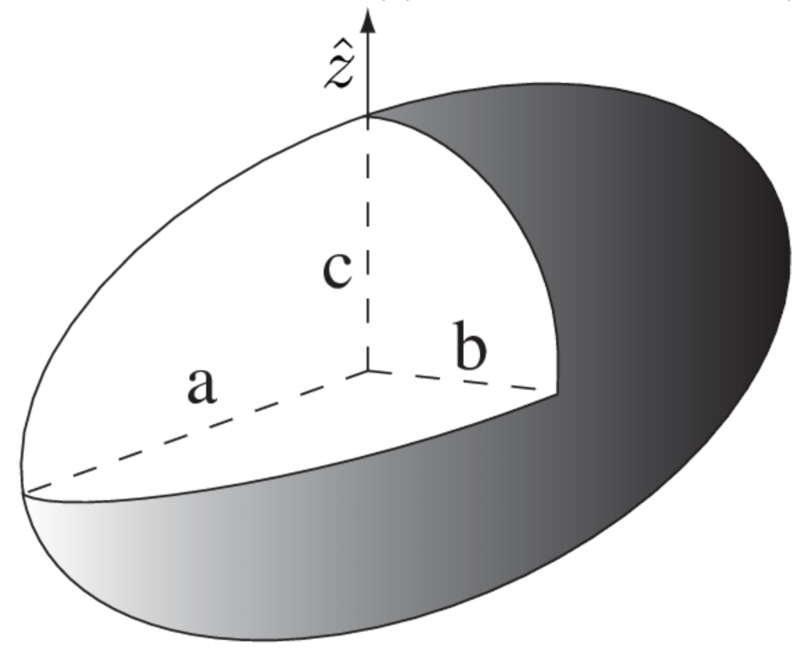

# `calcMass_Fuselage.m`
> Yuya Sugo, Performance Lead 2024-2025, USC AeroDesign Team </br> 5/28/2024

<!--ts-->
* [calcMass_Fuselage.m](#calcmass_fuselagem)
   * [Main Purpose](#main-purpose)
   * [Background Knowledge](#background-knowledge)
   * [Code Breakdown](#code-breakdown)

<!-- Created by https://github.com/ekalinin/github-markdown-toc -->
<!-- Added by: yuyasugo, at: Wed May 29 00:49:47 JST 2024 -->

<!--te-->

## Main Purpose

This is a function that takes in a `plane` struct and returns the mass of the fuselage `massFuselage`. 

## Background Knowledge

Historically, ADT's fuselages have looked very different in terms of build methods and material choice to the shape of the fuselage. For example:

- 2023-24: Builtup Truss Fuselage with Solite Skin+ Tail boom (there has been some work to estimate this, will be updated in future revisions)
- 2022-23: CF Monocoque Fuselage + Tail boom
- 2021-22: Semi-monocoque, foamcore/composite skin
- 2020-21: CF backbone with plywood formers and Kevlar skin

Just to name a few. 

The code implemented in this function is for a **CF Monocoque** fuselage!

## Code Breakdown
```MATLAB
function [massFuselage] = calcMass_Fuselage(plane)
```
Function declaration header, with input `plane` struct and returning double `massFuselage`.

```MATLAB
%% INPUTS
% epoxy
epoxy_ratio = 0.55;

% density of materials
density_carbonFiber = 5.5 / 29.494; %oz/yd2 --> kg/m2
density_fiberGlass = 3 / 29.494; %oz/yd2 --> kg/m2
density_foam = 48.06; % kg/m3 (3 lbs/ft3)
density_balsa = 160; %kg/m3
density_ply = 680; %kg/m3
```
Defining mass properties.

```MATLAB
% assign params from plane
wFuse = plane.wFuse;
hFuse = plane.hFuse;
lFuse = plane.lFuse;
```
`wFuse` Fuselage Width, `hFuse` Fuselage Hight, `lFuse` Fuselage Length.

```MATLAB
% surface area
pEllipsoid = 1.6075;
aEllipsoid = lFuse/2;
bEllipsoid = hFuse/2;
cEllipsoid = wFuse/2;
SA_fuse = 4*pi* ( (aEllipsoid.^pEllipsoid.*bEllipsoid.^pEllipsoid + ...
    aEllipsoid.^pEllipsoid.*cEllipsoid.^pEllipsoid + ...
    bEllipsoid.^pEllipsoid.*cEllipsoid.^pEllipsoid) / 3 ).^(1/pEllipsoid);
```

Approximating the fuselage to be a ellipsoid, finds the surface area of the fuselage using this equation:
```math
S \approx 4\ \pi\ \sqrt{\frac{(a\ b)^P\ (a\ c)^P\ (b\ c)^P\ }{3}}
```
Where `a`, `b`, and `c` are the lengths of the semi-axis of the ellipse defined like below. `P=1.6075` and that is fixed for all Ellipsoid. 



```MATLAB
% CF - 1 ply
m_CF = SA_fuse * density_carbonFiber;

% Wet tape joining two fuselage halves
area_wetTape = 0.25 * wFuse * 2 * lFuse;
m_wetTape = area_wetTape * density_carbonFiber;

% Fiber Glass - 1 ply
m_FG = SA_fuse * density_fiberGlass;

% Epoxy
m_epoxy_skin = (epoxy_ratio/(1-epoxy_ratio)) * (m_FG+m_CF+m_wetTape);
```
Then it calcualtes the mass of the CG and the FG (assuming this fuselage has a CF and a FG skin), as well as the masses of the CF tape and epoxy for all composite materials. 

```MATLAB
area_platform = wFuse * (lFuse - 3*hFuse); % [m^2] width times (length - tailcone length)
thick_platform = 0.25 * 0.0254; % [in -> m]
m_platform = area_platform * thick_platform * density_ply; % kg
```
This fuselage had a platform that held the tail boom, so the mass estimate for this. 

```MATLAB
massFuselage = sum([m_CF m_wetTape m_FG m_epoxy_skin m_platform]);
```
Finally, adding up all of the masses.